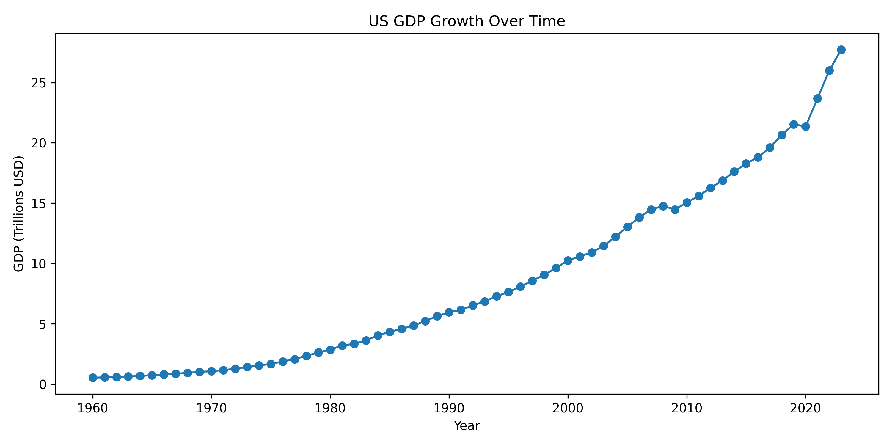

# US Economy and EV Adoption Visualization

This project explores two datasets: US GDP growth over time and the increasing adoption of electric vehicles (EVs) in Washington state.

## US GDP Growth Over Time

This plot shows the historical growth of the US GDP from 1960 to 2023 in current US dollars. The data was sourced from the World Bank.

**Data Source**: [awesome-json-datasets](https://api.worldbank.org/v2/countries/USA/indicators/NY.GDP.MKTP.CD?per_page=5000&format=json)

## Electric Vehicle Population in Washington

This plot visualizes electric vehicle adoption trends based on state registration data. The dataset includes EV make, model, and registration locations.

**Data Source**: [Data.Gov](https://catalog.data.gov/dataset/electric-vehicle-population-data)

## Project Instructions

You can find the original instructions for this project [here](https://github.com/mikeizbicki/cmc-csci040/tree/2025spring/project_02_visualizing_datasets).
